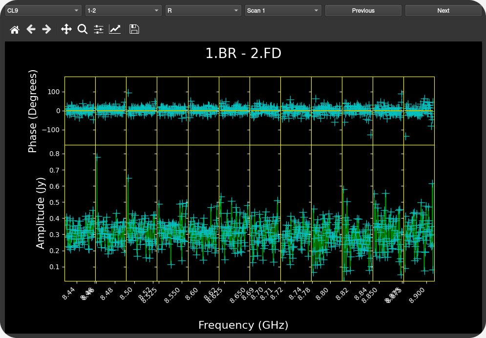

Usage
=====

Upon opening the pipeline, you will be presented with two modes:

Manual Input
~~~~~~~~~~~~

.. image:: _static/mainmenu.png
   :alt: main VIPCALs menu
   :align: center
   :width: 600px

.. raw:: html

     
   
This mode allows calibration of a single observation (which may include multiple files) and lets you inspect the results via interactive plots. Below is a description of the different parameters that can be used, both compulsory and optional.

**Minimum Required Inputs**

- *User number*: AIPS user number *(manual installation only)*
- *Disk number*: AIPS disk number *(manual installation only)*
- *Filepath*: file(s) to calibrate
- *Output directory*: directory for output products
- *Target*: name(s) of science target(s) to calibrate

**Additional Options**

- **Calibration Options**

  - *Calibrate all*: calibrate all sources (default: only science target(s))
  - *Phase ref calibrator*: define specific source(s) to use as phase reference calibrator(s)

- **Loading Options**

  - *Load all sources*: load all sources (default: only science target(s) + 3 tentative calibrators)
  - *Load amp. calibration tables*: load external tables with system temperatures and gain curves in AIPS ANTAB format.
  - *Time average threshold*: minimum integration time in seconds. If the data have a shorter time sampling, it will be averaged in time up to this value (0 to disable)
  - *Freq. average threshold*: minimum channel width in kHz. If the data have narrower channels, they will be averaged in frequency up to this value (0 to disable)
  - *Phase center shift*: give coordinates to shift the phase center of each target if more accurate positions are available.  
    Format: ``"175.858625 18.577322"`` or ``"11h43m26.07s +18d34m38.36s"``

- **Reference Antenna Options**

  - *Reference antenna*: fixed reference antenna (e.g., `"LA"`)
  - *Priority antennas*: list of preferred antennas to be used as reference antenna (e.g., `"LA"`, `"FD"`, `"EF"`)
  - *Search central antennas*: prioritize central array antennas (VLBA only)
  - *Maximum scans*: maximum number of scans per source to use in the automatic reference antenna search *(default: 10)*

- **Fringe Fit Options**

  - *Signal-to-noise threshold*: minimum SNR accepted during the FFT step of the fringe fit on the science target
  - *Fixed solution interval*: fixed solution interval in minutes
  - *Minimum solution interval*: minimum allowed interval (in minutes) when searching for the optimal solution interval
  - *Maximum solution interval*: maximum allowed interval (in minutes) when searching for the optimal solution interval

- **Export Options**

  - *Channel out*:

    - `SINGLE`: before exporting, average in frequency to 1 channel per IF
    - `MULTI`: export all channels

  - *Edge flagging*: when exporting:

    - If < 1: flag that fraction of edge channels at the beginning/end of each IF
    - If ≥ 1 and integer: flag that number of edge channels at the beginning/end of each IF

- **Plotting Options**

  - *Interactive plots*: enable GUI plots (manual mode only)
  
  .. warning::
     Generating these plots can consume lots of time and disk storage. It is advised to disable them for large datasets.  
     Static `.ps` and `.pdf` plots are always saved in the output directory.
  
  
Pipeline log
------------
  
During the pipeline run, real time information is displayed in the GUI. All this information will be also available as a text file after the calibration.

   
.. raw:: html

     

Interactive plots
-----------------

After a successful pipeline run, the user is given the option to display some diagnostic plots. The available plots are 

- Amplitude and phase vs Frequency
- Calibrated amplitude and phase vs Time
- Calibrated amplitude and phase vs uv-distance
- uv coverage

These plots are grouped by source and frequency band. 

   
.. raw:: html

     
   

   
.. raw:: html

     
   

   
.. raw:: html

     
   
   
.. warning::
     The interactive plots are under active development and still present some small bugs, especially when there is no data available for multiple baselines.

----

JSON Input
~~~~~~~~~~

For batch processing, inputs can be supplied via a JSON file. All parameters mirror the manual input described above. As before, when running in Docker, both `userno` and `disk` should be omitted.

**Minimum JSON Fields**

+--------------------+----------------+
| Key                | Type           |
+====================+================+
| userno             | int            |
+--------------------+----------------+
| disk               | int            |
+--------------------+----------------+
| paths              | list of str    |
+--------------------+----------------+
| targets            | list of str    |
+--------------------+----------------+
| output_directory   | str            |
+--------------------+----------------+

**Optional JSON Fields**

+---------------------------+----------------------------+
| Key                       | Type                       |
+===========================+============================+
| calib_all                 | bool                       |
+---------------------------+----------------------------+
| phase_ref                 | list of str                |
+---------------------------+----------------------------+
| load_all                  | bool                       |
+---------------------------+----------------------------+
| load_tables               | str                        |
+---------------------------+----------------------------+
| time_aver                 | float                      |
+---------------------------+----------------------------+
| freq_aver                 | float                      |
+---------------------------+----------------------------+
| shifts                    | list of str                |
+---------------------------+----------------------------+
| refant                    | str                        |
+---------------------------+----------------------------+
| refant_list               | list of str                |
+---------------------------+----------------------------+
| search_central            | bool                       |
+---------------------------+----------------------------+
| max_scan_refant_search    | float                      |
+---------------------------+----------------------------+
| fringe_snr                | float                      |
+---------------------------+----------------------------+
| solint                    | float                      |
+---------------------------+----------------------------+
| min_solint                | float                      |
+---------------------------+----------------------------+
| max_solint                | float                      |
+---------------------------+----------------------------+
| channel_out               | str ("SINGLE" or "MULTI")  |
+---------------------------+----------------------------+
| flag_edge                 | float                      |
+---------------------------+----------------------------+

**Examples**

Below you can find some examples of typical JSON files that can be given to VIPCALs

.. code-block:: json

   {
     "userno": 4,
     "disk": 9,
     "paths": [
       "/data/pipeline_test_sample/diego/BR235/BR235M/VLBA_BR235M_br235m_BIN0_SRC0_0_210726T164755.idifits"
     ],
     "targets": ["1611+179", "1428+254", "1443+188"],
     "output_directory": "/home/dalvarez/vipcals/vipcals/101_200",
     "refant_list": ["LA", "FD"]
   }

   {
     "userno": 4,
     "disk": 9,
     "paths": [
       "/data/pipeline_test_sample/felix/BR235/BR235O/VLBA_BR235O_br235o_BIN0_SRC0_0_210217T213934.idifits"
     ],
     "targets": ["0912+237"],
     "output_directory": "/home/dalvarez/vipcals/vipcals/101_200",
     "shifts": ["138.72500917 23.53151889"]
   }

Note that sources and coordinates in the *"phase_ref"* and *"shifts"* fields have to be given in the same order as the sources in the *"targets"* field. If there is any source where those options should not apply, then it can be skipped by giving a null value:

.. code-block:: json

   {
     "userno": 4,
     "disk": 9,
     "paths": [
       "/data/pipeline_test_sample/felix/BR235/BR235O/VLBA_BR235O_br235o_BIN0_SRC0_0_210217T213934.idifits"
     ],
     "targets": ["0737+171", "0912+237"],
     "phase_ref": ["0740+155", null],
     "output_directory": "/home/dalvarez/vipcals/vipcals/101_200",
     "shifts": [null, "138.72500917 23.53151889"]
   }
   
----

Outputs
~~~~~~~~

Below is a representative structure of the output directory produced by the pipeline:

.. code-block:: text

    EA075/
    ├── J1159+2914_EA075_22G_2024-03-13/
    │   ├── PLOTS/
    │   │   ├ 1159+2914_EA075_22G_2024-03-13_CL1_POSSM.ps
    │   │   ├ 1159+2914_EA075_22G_2024-03-13_CL9_POSSM.ps
    │   │   ├ 1159+2914_EA075_22G_2024-03-13_TSYS_TY1.ps
    │   │   ├ 1159+2914_EA075_22G_2024-03-13_TSYS_TY2.ps
    │   │   ├ 1159+2914_EA075_22G_2024-03-13_UVPLT.ps
    │   │   ├ 1159+2914_EA075_22G_2024-03-13_VPLOT.ps
    │   │   ├ 1159+2914_EA075_22G_2024-03-13_RADPLOT.pdf
    │   │   ├ 1159+2914_EA075_22G_2024-03-13_VISANT.pdf
    │   │
    │   ├── TABLES/
    │   │   ├ flags.vlba
    │   │   ├ gaincurves.vlba
    │   │   ├ tsys.vlba
    │   │   ├ 1159+2914_EA075_22G_2024-03-13.caltab.uvfits
    │   │
    │   ├ 1159+2914_EA075_22G_2024-03-13.stats.csv
    │   ├ 1159+2914_EA075_22G_2024-03-13.uvfits
    │   ├ 1159+2914_EA075_22G_2024-03-13_AIPSlog.txt
    │   ├ 1159+2914_EA075_22G_2024-03-13_scansum.txt
    │   ├ 1159+2914_EA075_22G_2024-03-13_VIPCALslog.txt
    │
    │
    ├── J1143+1834_EA075_22G_2024-03-13/
    │   ├── 
    :   :
    :   :

For each calibrated source, there is a directory that contains:

- *\*.stats.csv*: metadata on the observation and the calibration process in csv format
- *\*.uvfits*: calibrated fits file
- *\*_AIPSlog.txt*: output produced by AIPS after each step
- *\*_scansum.txt*: summary of the observation including scan list and frequency setup
- *\*_VIPCALslog.txt*: human-readable summary of the calibration produced by VIPCALs

The pipeline also generates the following plots inside the */PLOTS/* folder:

- *\*_CL1_POSSM.ps*: uncalibrated visibilities vs frequency
- *\*_CL9_POSSM.ps*: calibrated visibilities vs frequency
- *\*\_TSYS\_TY1.ps*: original antenna system temperatures vs time
- *\*\_TSYS\_TY2.ps*: smoothed antenna system temperatures vs time
- *\*\_UVPLT.ps*: UV coverage of the calibrated observation
- *\*\_VPLOT.ps*: calibrated visibilities vs time
- *\*\_RADPLOT.pdf*: calibrated visibilities vs uv-distance
- *\*\_VISANT.pdf*: number of visibilities per antenna across the different calibration tables

and the following tables in the */TABLES/* folder:

- *flags.vlba*: initial flags of the observation (if not included in the file)
- *gaincurves.vlba*: gain curves of each antenna (if not included in the file)
- *tsys.vlba*: antenna system temperatures (if not included in the file)
- *\*.caltab.uvfits*: AIPS tables used during the calibration
